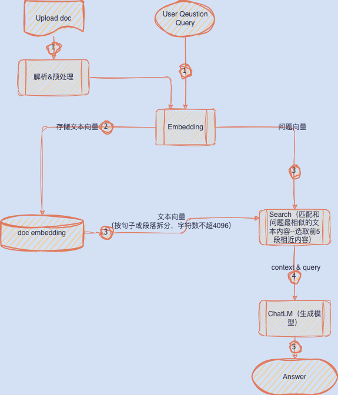
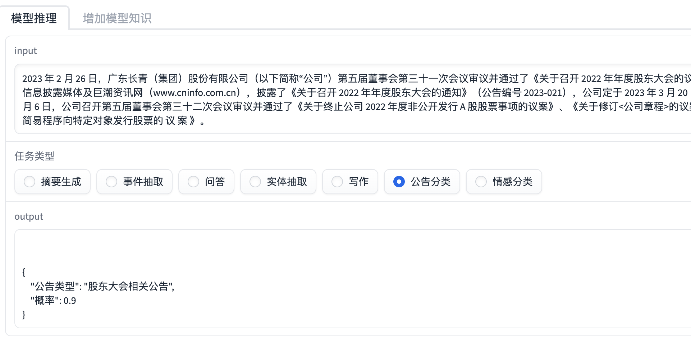
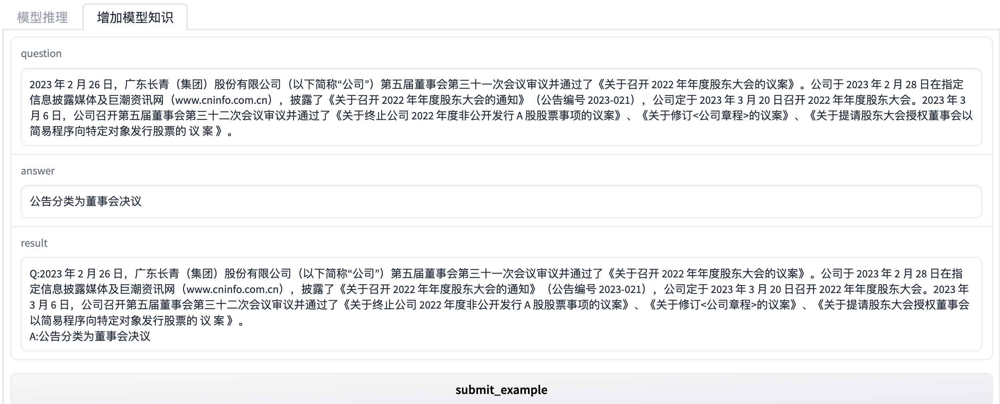

# ChatLLM Pro

> 基于大语言模型的智能应用开发平台，提供文档解析、知识问答、文本抽取等NLP服务。支持多种LLM模型，集成向量数据库，可快速构建企业级AI应用。

## 核心功能

- 🤖 **多模型支持**: 集成OpenAI GPT、自定义LLM等多种语言模型
- 📄 **文档解析**: 支持PDF、Word等格式文档的智能解析和问答
- 🔍 **文本抽取**: 基于LangChain的结构化信息抽取服务
- 🧠 **向量检索**: 集成Qdrant向量数据库，支持语义相似度搜索
- 🌐 **Web界面**: 基于Gradio的友好交互界面
- 🔧 **API服务**: RESTful API接口，便于集成到其他系统

## 流程图
<div align="center">
    
</div>

## 快速开始

### 环境要求
- Python >= 3.12
- pip 或 uv (推荐)

### 安装依赖

使用 uv (推荐):
```bash
# 安装 uv
curl -LsSf https://astral.sh/uv/install.sh | sh

# 安装项目依赖
uv sync
```

使用传统方式:
```bash
# 创建虚拟环境
python -m venv venv
source venv/bin/activate  # Linux/Mac
# 或 venv\Scripts\activate  # Windows

# 安装依赖
pip install -r requirements.txt
```

### 运行服务

**API服务器**:
```bash
# 启动文档抽取API服务
python api/server.py
```

**Web界面**:
```bash
# 启动Gradio Web界面
python web/v2/chat_server.py
```

### Docker部署

```bash
# 构建镜像
docker-compose build

# 启动服务
docker-compose up -d
```

## API文档

### 文档抽取API

**获取模型列表**
```bash
GET /api/v1/llm/model_list
```

**文档信息抽取**
```bash
POST /api/v1/llm/extraction
Content-Type: application/json

{
    "text": "要抽取的文本内容",
    "schema": "person_schema"  // 使用的抽取模式
}
```

### 使用示例

**Python调用示例**:
```python
import requests

# 获取可用模型
response = requests.get("http://localhost:5000/api/v1/llm/model_list")
models = response.json()["data"]

# 文档抽取
data = {
    "text": "张三是一位软件工程师，住在北京，电话是13812345678",
    "schema": "person_schema"
}
response = requests.post("http://localhost:5000/api/v1/llm/extraction", json=data)
result = response.json()
```

## Web界面预览

<div align="center">
    
</div>

<div align="center">
    
</div>

## 已知限制

1. **模型调参**: 响应结果的调优手段相对有限
2. **网络依赖**: 部分功能依赖第三方API，建议部署时考虑网络稳定性
3. **性能优化**: 大文档处理时可能存在内存和响应时间问题

## 更新日志

## 项目架构

```
chat-llm-pro/
├── api/                 # API服务模块
│   └── server.py       # Flask API服务器
├── src/                # 核心功能模块
│   ├── memect_llm.py   # 自定义LLM封装
│   ├── extract.py      # 文本抽取功能
│   ├── gpt.py          # GPT相关功能
│   └── utils/          # 工具函数
├── web/                # Web界面
│   ├── v1/             # 第一版界面
│   └── v2/             # 第二版界面
├── model/              # 数据模型
├── data/               # 数据文件
├── tests/              # 测试文件
└── requirements.txt    # 依赖列表
```

## 技术栈

- **后端**: Flask, LangChain, OpenAI API
- **前端**: Gradio Web UI
- **向量数据库**: Qdrant
- **向量化**: FAISS, 本地embedding模型
- **文档处理**: KOR (基于LangChain的信息抽取)

## 开发计划

- [x] 实现docker化服务器部署
- [x] 基于gradio的UI DEMO交互体验 
- [x] 支持摘要生成，问答，情感分类的场景
- [x] 支持选择模型
- [x] 支持类chatpdf功能
- [x] 引入langchain工具，加速应用构建
- [x] 基于langchain工具进行文档抽取server开发
- [x] 引入text2vec模型，进行词向量计算
- [ ] Web v3版本引入Vue3，实现文档级别的问答

## 参考文档

- [OpenAI API](https://platform.openai.com/docs/models)
- [Gradio文档](https://gradio.app/)
- [LangChain文档](https://docs.langchain.com/)
- [Qdrant向量数据库](https://qdrant.tech/documentation/)

## 许可证

MIT License

## 贡献

欢迎提交 Issue 和 Pull Request 来改进项目。
