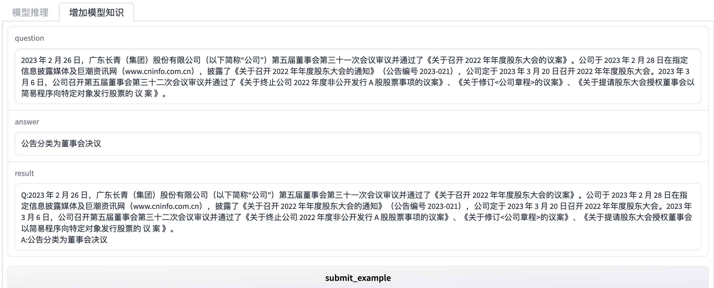

# ChatLLM
> 从2022年下半年到2023，Chatgpt显得低调且惊艳，本项目主要基于各类语言模型coding NLP相关应用。

## 流程图


##  run env
```shell
# pipreqs --force
# python>=3.8
virtualenv -p python venv
source venv/bin/activate
```
## 编译镜像

```shell
$ docker-compose build
```

## Web UI





## 日志
### 局限
1. 调参能力有限。响应结果的干预手段有限
2. 需要走第三方网络请求，稳定性不强，如何内网部署使用
### 进度
- [x] 实现了docker化服务器部署
- [x] 基于gradio的UI DEMO交互体验 
- [x] 支持摘要生成，问答，情感分类的场景
- [x] 支持选择模型
- [x] 支持类chatpdf功能
- [x] 引入langchain工具，加速应用构建
- [ ] 基于langchin工具进行文档抽取server开发。

### 参考文档
1. gpt-3 https://platform.openai.com/docs/models/gpt-3
2. web界面 https://gradio.app/ 
3. gpt3.5-api https://platform.openai.com/docs/guides/chat/instructing-chat-models

---
获取体验key或文因金融语言模型可联系lihanghang@memect.co
